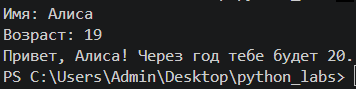
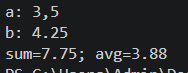
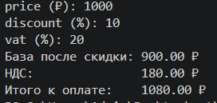
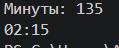
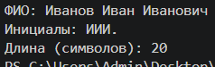

## ЛР1 — Ввод/вывод и форматирование

### Задание 1

Вывод информации при помощи f-строки, приём разных типов данных.

### Задание 2

Обработка входных чисел, вывод среднего и суммы.

### Задание 3

Подсчёт итоговой суммы, НДС, и базы после скидки. Вывод с по строкам и с двумя знаками после запятой.

### Задание 4

Перевод минут в формат часы:минуты.

### Задание 5

Поиск и вывод инициалов введённого ФИО, подсчёт символов ФИО с двумя пробелами.

