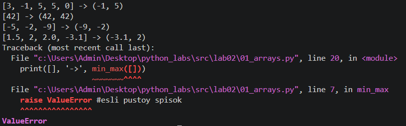
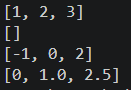
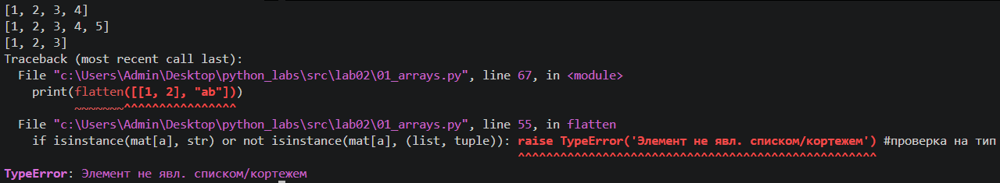
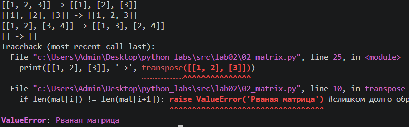
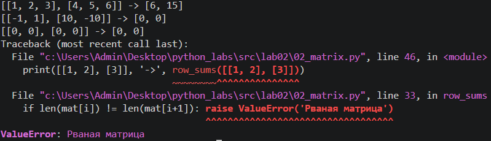
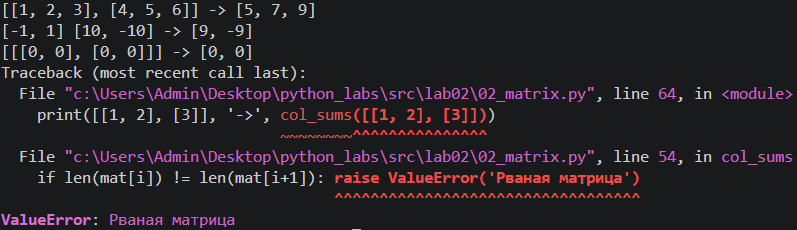
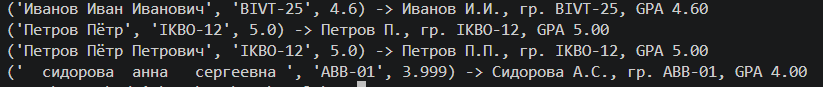

# ЛР2 — Коллекции и матрицы (list/tuple/set/dict)

## Задание 1

Реализовал 3 функции.
### Функция 1 - min_max - поиск минимального и максимального значений

### Функция 2 - unique_sorted - сортировка уникальных значений

### Функция 3 - flatten - позволяет "расплющить" список списков/кортежей в один список по строкам (row-major)

## Задание 2
Реализовал 3 функции.
### Функция 1 - transpose - транспонирует матрицу

### Функция 2 - row_sums - суммирует строки матрицы

### Функция 3 - col_sums - суммирует столбцы матрицы

## Задание 3
Работа с «записями» как с кортежами.
1. Определил тип записи студента как кортеж
2. Реализовал функцию format_record, вернув строку определенного вида по определенным правилам.

